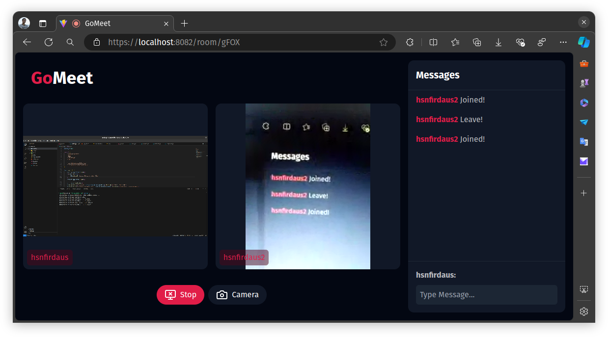

# GoMeet

Eksperimen saya terkait penggunaan [WebRTC](https://webrtc.org/) untuk membuat Video Conference Meeting seperti Google Meet dan Zoom.

## Pendahuluan

[WebRTC](https://webrtc.org/) adalah teknologi web modern yang memungkinkan terjadinya komunikasi _real time_ dalam sebuah aplikasi Web. Komunikasi yang dimaksud dapat berupa pengiriman video, suara maupun data lainnya.

WebRTC memungkinkan adanya pertukaran data langsung antara 2 client (_peer to peer_) tanpa memerlukan bantuan server untuk me-_relay_ data. Namun, komunikasi P2P kadang terhalang oleh NAT atau _Network Address Translation_ sehingga device tidak bisa berkomunikasi langsung karena tidak mengetahui IP yang bisa diakses secara langsung oleh device lain.

Disinilah perlunya peran [STUN](https://en.wikipedia.org/wiki/STUN) yang bisa mendapatkan informasi IP Publik yang bisa digunakan. Jika STUN gagal untuk dapat digunakan maka solusi lainnya adalah WebRTC akan menggunakan [TURN](https://en.wikipedia.org/wiki/Traversal_Using_Relays_around_NAT) sebagai server _relay_ data.

## Cara Kerja

Untuk memulai koneksi _peer_ menggunakan WebRTC ada beberapa hal yang perlu dilakukan:

### Melakukan _Capturing_ Media

Client 1 memerlukan media yang akan dikirim ke client 2. Disini kita bisa menggunakan `navigator.mediaDevices.getUserMedia` untuk mengambil kamera dan audio dari _device_, atau `navigator.mediaDevices.getDisplayMedia` untuk mendapatkan _screen capture_ dari _device_. Hasil _capture_ media ini akan menghasilkan sebuah `MediaStream`.

### Menginisialisasi WebRTC

Client 1 melakukan inisialisasi `RTCPeerConnection`. Dan menambahkan `MediaStream` yang sudah di-_capture_ ke koneksi _peer_ dengan `addTrack`.

### Melakukan _Signaling_

Meskipun WebRTC dapat mengirimkan media secara langsung tanpa bantuan server. Kita memerlukan sebuah server untuk melakukan _signaling_ (pertukaran informasi terkait bagaimana masing-masing _Client_ dapat berkomunikasi). Sebenarnya, proses _signaling_ ini pun secara teori juga dapat dilakukan tanpa menggunakan server. Seperti melakan _generate_ Kode QR pada pengirim dan melakukan _scanning_ Kode QR pada penerima.

Pada proyek ini saya menggunakan server WebSocket dengan bahasa Go.

- #### Membuat _Offer_

  Ketika _Client 1_ pertama kali melakukan inisialisasi koneksi _peer_ dengan _Client 2_, _Client 1_ perlu melakukan negosiasi dengan _Client 2_. Apakah _Client 2_ akan menerima permintaan koneksi P2P dari _Client 1_.

  Di `RTCPeerConnection` yang sudah dibuat kita perlu melakukan _handling event_ `onnegotiationneeded`. Di _handler event_ tersebut kita perlu mengambil informasi [SDP](https://en.wikipedia.org/wiki/Session_Description_Protocol) dari _Client 1_ (informasi terkait _network_ dan lainnya) dengan memanggil `createOffer` dari `RTCPeerConnection` yang telah dibuat. Lalu memanggil `setLocalDescription` untuk menyimpan informasi SDP lokal kita ke dalam _peer_.

- #### Mengirimkan _Offer_

  _Client 1_ perlu mengirimkan informasi SDP nya ke _Client 2_. Di sinilah server _signaling_ berguna. Informasi SDP _Client 1_ dikirimkan ke _Client 2_ melalui WebSocket.

- #### Menerima _Offer_

  _Client 2_ akan menerima informasi SDP _Client 1_ dari WebSocket. Lalu _Client 2_ juga melakukan inisialisasi `RTCPeerConnection` dan mengatur informasi _SDP Client 1_ ke _peer_ dengan menggunakan fungsi `setRemoteDescription`.

- #### Membuat & Mengirim _Answer_

  _Client 2_ perlu mengirimkan informasi SDP nya juga ke _Client 1_. Dengan menggunakan fungsi `createAnswer` dari `RTCPeerConnection` dan mengatur _local description_ _peer_-nya dengan menggunakan fungsi `setLocalDescription`.

  Selanjutnya _answer_ tersebut perlu dikirimkan oleh _Client 2_ ke _Client 1_ dengan protokol _signaling_ (WebSocket).

- #### Menerima _Answer_

  _Client 1_ menerima _answer_ (informasi SDP) _Client 2_ dari WebSocket dan mengatur _remote description_ di `RTCPeerConnection` _Client 1_ dengan `setRemoteDescription`.

- #### Meng-_handle_ ICE Candidate

  _Browser_ akan mencari tahu cara terbaik bagaimana _client_ dapat terhubung satu sama lain. Masing-masing _client_ perlu meng-_handle_ _event_ `onicecandidate` dari `RTCPeerConnection`.

  ICE Candidate yang sudah didapatkan perlu dikirim ke _client_ lain menggunakan WebSocket.

  _Client_ yang menerima informasi ICE Candidate dari WebSocket lalu memasukannya ke `RTCPeerConnection` dengan menggunakan fungsi `addIceCandidate`.

- #### Meng-_handle_ Track Media

  Masing-masing client perlu meng-_handle_ _event_ `ontrack` untuk menyimpan `MediaStream` dari _client_ lain sehingga dapat ditampilkan di _Browser_.

  Misalnya kita menerima _video_, kita dapat mengatur `srcObject` dari elemen _video_ tersebut dari javascript menjadi `MediaStream` yang telah didapatkan.

### Catatan

- Satu koneksi WebRTC bisa digunakan kedua belah pihak untuk mengirim dan menerima beberapa media dan data. Artinya anda cukup memanggil `addTrack` jika ingin menambahkan audio atau _video_ yang dikirimkan ke client lainnya.
- Anda dapat melihat _source code_ dari file [gomeet-fe/src/lib/Rooms.Class.ts](gomeet-fe/src/lib/Rooms.Class.ts) untuk melihat implementasi WebRTC ini.
- _Screen Capture_ saat ini hanya tersedia di _browser desktop_.
- Hak akses ke kamera, audio dan _Screen Capture_ hanya bisa dilakukan di _secure connection_ atau https dan di localhost.
- Disini saya menggunakan STUN server dari google (bisa dilihat di [gomeet-fe/src/lib/peer.ts](gomeet-fe/src/lib/peer.ts)) dan bekerja pada untuk koneksi P2P antar device dalam lokal network saya.
- Ketika menggunakan jaringan kartu _SIM Mobile_ biasa (setidaknya untuk provider yang saya gunakan), saya harus menggunakan server TURN agar koneksi P2P dapat bekerja. Anda dapat mencoba server TURN gratis dari [metered.ca](https://www.metered.ca/tools/openrelay/)

## Teknologi

- Go
  - [gorilla/websocket](https://github.com/gorilla/websocket)
  - [gorilla/mux](https://github.com/gorilla/mux)
  - [joho/godotenv](https://github.com/joho/godotenv)
- React
  - [Axios](https://github.com/axios/axios)
  - [React Router](https://github.com/remix-run/react-router)
  - [TailwindCSS](https://github.com/tailwindlabs/tailwindcss)

## Referensi

- [https://medium.com/securemeeting/getting-web-development-right-webrtc-tutorial-golang-and-react-2c87a6eaf3ff](https://medium.com/securemeeting/getting-web-development-right-webrtc-tutorial-golang-and-react-2c87a6eaf3ff)
- [https://blog.logrocket.com/webrtc-video-streaming/](https://blog.logrocket.com/webrtc-video-streaming/)
